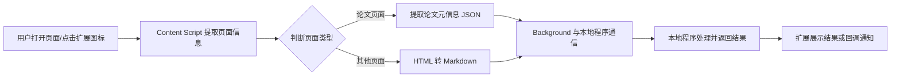

---
## 一、项目目标与范围
**目标：**  
做一个跨浏览器（Chrome / Edge / Firefox，Manifest V3）扩展，实现：
1. 自动识别当前页面是否为“论文页面”。
2. 若是论文页面：提取论文元信息，按 JSON 协议发送给你开发的本地程序。
3. 若非论文页面：将网页内容转换为 Markdown，将 Markdown 文本发送给本地程序。
4. 本地程序负责后续处理（入库、AI 分析、导出等）。
**范围：**
- 浏览器扩展（前端 + content script + background/service worker）。
- 与本地程序的通信协议（基于 native messaging）。
- 论文元数据字段与 Markdown 转换规则。
---
## 二、整体架构概览
用一个简单流程图先梳理全局：

---
## 三、功能需求
### 3.1 页面类型识别
**需求描述：**
扩展需要判断当前页面是否为“论文页面”，并据此选择不同处理分支。
**识别规则（按优先级从高到低）：**
1. **URL 规则匹配（高优先级）**
   - 命中已知论文平台域名 / URL 模式时，优先视为论文页面：
     - arXiv：`https://arxiv.org/abs/*`，`https://arxiv.org/pdf/*`
     - PubMed：`https://pubmed.ncbi.nlm.nih.gov/*`
     - DOI 落地页：`https://doi.org/*` 或页面 URL 中包含 `/doi/`、`doi.org/10.` 等
     - 其他常见学术平台：ACL、IEEE、ACM、Springer、Elsevier、Wiley、Sage、Nature、Science 等域名（建议配置域名列表，可扩展）。
   - 规则配置方式：
     - 在扩展选项页中提供“论文域名白名单”配置，支持：
       - 默认内置常见平台列表。
       - 用户手动添加/删除域名。
2. **HTML meta 标签识别（中优先级）**
   - 若页面存在典型的学术 meta 标签，则判定为论文页面：
     - `citation_title`、`citation_author`、`citation_doi`、`citation_journal_title`、`citation_publication_date` 等 Highwire / Google Scholar 常用标签。
   - 规则示例：
     - 同时存在 `citation_title` + `citation_author` + (`citation_doi` 或 `citation_journal_title`) 时，视为论文页面。
     - 可在选项页提供“使用 meta 标签识别”开关及阈值配置。
3. **JSON-LD / schema.org 识别（可选）**
   - 若页面包含 `@type: "ScholarlyArticle"` 或 `"Article"` 的 JSON-LD，可视为论文页面。
   - 可作为辅助规则，在 URL/meta 都不明显时使用。
4. **手动标记（兜底）**
   - 提供“当前页面视为论文 / 普通网页”的按钮，覆盖自动判断结果。
   - 结果可缓存到 `localStorage` 或 `storage.local`，下次访问同一域名时默认使用手动标记结果。
**输出：**
- `pageType: "paper" | "webpage"`，用于后续处理分支。
---
### 3.2 论文页面：元信息提取
**需求描述：**
对判定为“论文页面”的页面，提取结构化学术元信息，封装为 JSON 对象，发送给本地程序。
**元数据字段设计（建议）：**
参考 Crossref / DataCite / schema.org 的常见字段：
| 字段名           | 类型             | 必填 | 说明 |
|------------------|------------------|------|------|
| `title`          | string           | 是   | 论文标题 |
| `authors`        | array of object  | 是   | 作者列表，每位作者包含 `name`, `affiliation[]`, `orcid`（可选）等 |
| `abstract`       | string           | 否   | 摘要 |
| `year`           | string / number  | 是   | 出版年份 |
| `month`          | string / number  | 否   | 出版月份 |
| `journal`        | string           | 否   | 期刊名 |
| `volume`         | string           | 否   | 卷 |
| `issue`          | string           | 否   | 期 |
| `pages`          | string           | 否   | 页码范围 |
| `doi`            | string           | 否   | DOI |
| `url`            | string           | 是   | 当前页面 URL（或最佳来源 URL） |
| `sourcePlatform` | string           | 是   | 来源平台，如 `"arXiv"`, `"PubMed"`, `"DOI"`, `"Other"` |
| `keywords`       | array of string  | 否   | 关键词 |
| `documentType`   | string           | 否   | 文献类型，如 `"article"`, `"conference"`, `"preprint"` |
| `citationCount`  | number           | 否   | 引用次数（需第三方接口） |
| `references`     | array of object  | 否   | 参考文献（可简化为 `[{title, doi, url}]`） |
| `fullTextUrl`    | string           | 否   | 全文 PDF / HTML 链接 |
| `metadataSource` | string           | 否   | 元数据来源：`"page"`, `"crossref"`, `"datacite"`, `"pubmed"` 等 |
**提取规则（按优先级）：**
1. **页面直接提取（首选）**
   - `title`：`<meta name="citation_title">` 或 `<h1 class="title">` 等语义化元素。
   - `authors`：`<meta name="citation_author">`（多个）或 `#author-list` 等结构化 HTML。
   - `journal`：`<meta name="citation_journal_title">`。
   - `year`：`<meta name="citation_publication_date">` 或页面中的年份文本。
   - `doi`：`<meta name="citation_doi">` 或页面文本中的 DOI 模式。
   - `abstract`：`<meta name="citation_abstract">` 或页面摘要区块。
2. **通过 DOI / API 补充（次选）**
   - 当页面缺少关键字段时，使用 DOI Content Negotiation 向 Crossref / DataCite 查询 JSON 元数据。
   - 可在扩展选项中配置：
     - 是否启用“通过 DOI 补充元数据”。
     - 超时时间、是否缓存等。
3. **平台适配规则**
   - arXiv：从页面解析 `arXiv ID`，构造 `https://arxiv.org/abs/{id}` 作为 `url`，`sourcePlatform = "arXiv"`。
   - PubMed：解析 PMID / PMCID，可调用 NCBI E-utilities API 获取结构化元数据。
   - 其他平台：类似地写适配脚本，提取关键元信息。
**输出：**
- `paperMeta` 对象，符合上述字段规范。
---
### 3.3 其他页面：转 Markdown
**需求描述：**
对非论文页面，将网页主体内容转换为 Markdown 文本，发送给本地程序。
**技术方案：**
1. 使用 Turndown.js（HTML → Markdown 库）在扩展中进行转换。
2. Turndown 支持配置：
   - `headingStyle`：`"atx"`（`#` 标题）或 `"setext"`。
   - `bulletListMarker`、`codeBlockStyle`、`fence` 等。
   - 通过 `addRule` 自定义规则，如过滤掉导航、广告、推荐等无关元素。
**需求细化：**
1. **正文识别与清理**
   - 参考 Readability 等算法，提取主要正文区域：
     - 尝试使用 `<main>`, `<article>`, `#content`, `.post`, `.article` 等选择器。
     - 过滤 `nav`, `aside`, `footer`, `.sidebar`, `.comments`, `.advertisement` 等非正文区域。
   - 提供选项：
     - “只转换选中部分”（用户选中文本后，右键菜单或扩展图标）。
     - “整页转换”（使用正文识别算法）。
2. **Markdown 转换规则**
   - 默认规则：
     - 标题：`h1` → `#`，`h2` → `##`，依此类推。
     - 列表：无序列表使用 `-`，有序列表使用数字。
     - 链接：`[text](url)`。
     - 图片：``，可选择是否下载图片并转为本地路径（由本地程序处理）。
   - 可选规则（可在选项页配置）：
     - 是否保留表格、代码块高亮。
     - 是否移除脚本/样式/注释。
     - 是否使用 GitHub Flavored Markdown（通过 turndown-plugin-gfm 插件）。
3. **编码与格式**
   - Markdown 文本使用 UTF-8 编码。
   - 在发送 JSON 中携带：
     - `title`：页面标题。
     - `url`：原始 URL。
     - `markdown`：转换后的 Markdown 文本。
     - `excerpt`：前 N 个字符的摘要（可配置长度）。
---
### 3.4 与本地程序通信
**需求描述：**
扩展需要将提取的 JSON 数据安全地发送给你开发的本地程序，并接收处理结果。
**技术方案：**
- 使用浏览器 Native Messaging：
  - 扩展侧：通过 `browser.runtime.connectNative` / `sendNativeMessage` 与本地程序通信。
  - 本地程序侧：通过 `stdin`/`stdout` 接收/发送 JSON 消息。
  - 通信协议：消息前加 32 位长度前缀，UTF-8 JSON 字符串。
**需求细化：**
1. **本地程序安装**
   - 本地程序需提供：
     - 原生消息宿主程序（可执行文件或脚本）。
     - 宿主清单文件（native messaging host manifest），包含：
       - `name`：如 `com.yourcompany.paperhelper`。
       - `path`：宿主程序路径。
       - `type`：`"stdio"`。
       - `allowed_extensions` 或 `allowed_origins`：允许连接的扩展 ID 列表。
   - 安装程序负责：
     - 将宿主清单写入系统目录或注册表（不同平台有固定位置）。
2. **扩展侧配置**
   - 扩展 manifest 需要权限：
     - `"nativeMessaging"`。
   - 选项页提供：
     - “本地程序名称”配置（对应宿主清单中的 `name`）。
     - 测试连接按钮，发送心跳消息，显示是否连通。
3. **消息协议设计**
   扩展 → 本地程序的消息格式示例：
   ```json
   {
     "type": "paper",
     "payload": {
       "title": "Paper Title",
       "authors": [
         { "name": "Author A", "affiliation": "Affiliation A" },
         { "name": "Author B", "affiliation": "Affiliation B" }
       ],
       "year": 2023,
       "journal": "Journal Name",
       "doi": "10.1234/example",
       "url": "https://doi.org/10.1234/example",
       "sourcePlatform": "DOI",
       "abstract": "This is an abstract...",
       "keywords": ["keyword1", "keyword2"],
       "fullTextUrl": "https://example.com/paper.pdf"
     },
     "context": {
       "tabId": 123,
       "url": "https://doi.org/10.1234/example",
       "pageTitle": "Paper Title",
       "timestamp": "2026-02-12T23:00:00Z"
     }
   }
   ```
   ```json
   {
     "type": "webpage",
     "payload": {
       "title": "Page Title",
       "url": "https://example.com/page",
       "markdown": "# Heading\n\nThis is some content.",
       "excerpt": "This is some content..."
     },
     "context": {
       "tabId": 123,
       "url": "https://example.com/page",
       "pageTitle": "Page Title",
       "timestamp": "2026-02-12T23:00:00Z"
     }
   }
   ```
   本地程序 → 扩展的响应示例：
   ```json
   {
     "status": "success",
     "message": "Saved to database.",
     "data": {
       "localId": "12345",
       "path": "/data/papers/2023/example.pdf"
     }
   }
   ```
4. **错误处理与重试**
   - 本地程序未启动或崩溃：
     - 扩展需捕获异常，显示错误提示，并提供“重试”按钮。
   - 超时：
     - 配置超时时间（如 5s），超时后提示用户。
   - 通信失败时，建议：
     - 暂存消息到 `storage.local`，待下次连接时重试（可选）。
---
### 3.5 用户界面与交互
**需求描述：**
扩展需提供简洁的 UI，方便用户触发操作、配置参数。
**UI 组件：**
1. **浏览器工具栏图标（Browser Action / Page Action）**
   - 单击：
     - 若未登录/未配置本地程序：弹出选项页提示配置。
     - 否则：根据当前页面类型自动执行提取或转换，并在弹窗中显示简要结果。
   - 弹窗内容：
     - 页面类型（论文 / 普通网页）。
     - 关键元信息（标题、作者、年份、期刊）。
     - Markdown 预览（前几行）。
     - “发送到本地程序”按钮。
     - “复制为 Markdown”按钮（可选）。
2. **右键菜单（Context Menu）**
   - 选中文字时，右键菜单：
     - “发送选中内容到本地程序（Markdown）”：
       - 将选中部分转换为 Markdown（简化版转换，无需整页正文识别）。
   - 页面空白处：
     - “发送当前页面到本地程序（自动识别类型）”。
3. **选项页（Options Page）**
   - “论文域名白名单”：
     - 文本域，每行一个域名或 URL 模式。
   - “识别规则配置”：
     - 开关：启用 URL 规则 / meta 标签 / JSON-LD 识别。
   - “Markdown 转换配置”：
     - 选择标题风格、列表标记、是否保留表格/图片等。
   - “本地程序连接配置”：
     - 宿主名称、测试连接按钮。
   - “日志级别”：
     - 是否开启调试日志（console）。
---
### 3.6 权限与安全需求
**权限需求：**
- `activeTab`：访问当前标签页内容。
- `tabs`：获取标签页信息（URL、标题）。
- `storage`：保存配置和临时数据。
- `nativeMessaging`：与本地程序通信。
- 可选：`<all_urls>` 或具体域名权限（如仅限学术站点），根据隐私策略决定。
**安全考虑：**
- 仅允许用户配置的可信本地程序连接。
- 不将敏感数据（如 cookie、密码）发送给本地程序。
- 用户配置的域名白名单仅用于页面类型识别，不用于其他用途。
---
## 四、非功能需求
### 4.1 性能要求
- 页面类型判断时间：< 100ms（在内容脚本中完成）。
- 论文元信息提取时间：< 1s（尽量在页面加载完成后触发）。
- Markdown 转换时间：普通网页 < 2s，超大页面可提示用户“正在转换”。
### 4.2 兼容性要求
- 浏览器：Chrome、Edge、Firefox 最新两个主版本（Manifest V3）。
- 平台：Windows、macOS、Linux（本地程序需跨平台）。
### 4.3 可维护性与可扩展性
- 模块化设计：
  - 页面识别模块（可插拔规则）。
  - 元数据提取模块（按平台适配）。
  - Markdown 转换模块（可配置规则）。
  - 通信模块（协议可升级）。
- 规则配置化：
  - 尽量将域名、选择器、字段映射等配置化，便于后续更新。
---
## 五、数据字典（JSON Schema 概要）
### 5.1 论文元信息 `PaperMeta`
```json
{
  "title": "string",
  "authors": [
    {
      "name": "string",
      "affiliation": ["string"],
      "orcid": "string?"
    }
  ],
  "abstract": "string?",
  "year": "number | string",
  "month": "number | string?",
  "journal": "string?",
  "volume": "string?",
  "issue": "string?",
  "pages": "string?",
  "doi": "string?",
  "url": "string",
  "sourcePlatform": "string",
  "keywords": ["string"],
  "documentType": "string?",
  "citationCount": "number?",
  "references": [
    {
      "title": "string?",
      "doi": "string?",
      "url": "string?"
    }
  ],
  "fullTextUrl": "string?",
  "metadataSource": "string?"
}
```
### 5.2 Web 页面 Markdown 信息 `WebpageMarkdown`
```json
{
  "title": "string",
  "url": "string",
  "markdown": "string",
  "excerpt": "string"
}
```
---
如果你后续需要，我可以进一步帮你拆分成“迭代计划”（比如 v0.1 只做基础识别和元信息提取，v0.2 加上 Markdown 转换，v0.3 加上配置 UI 和错误重试），或者给出更具体的接口定义（API）和错误码表。
